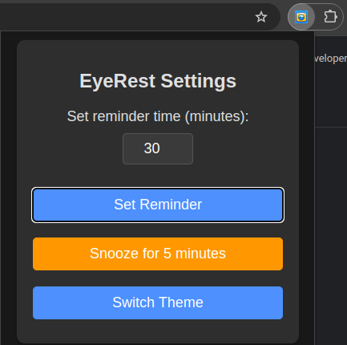

# EyeRest

  
**EyeRest** is a Chrome extension that reminds you to take a break.

## Will it support Firefox?
**Yes!** I will add it to Firefox extensions once MV3 is introduced to Firefox.

## Features

  
- Set the time interval for your break reminders.  
- Working on something SUPER important? **Snooze** the reminder!  
- EyeRest allows you to change the theme to suit your preferences.

## Data Storing
All data is stored in Chrome storage, so you won't need to reset your preferred theme or reminder time every time you open the browser.  
The author of this program does not have access to your data!

## Developer mode
To run this extension in developer mode type ```chrome://extensions/``` in Chrome search bar and click ```Load unpacked```

## Contributing
Contributions are always welcome! If you'd like to contribute, please follow these steps:

1. Fork the repository.
2. Create a new branch  
    `git checkout -b feature-branch`
3. Make your changes and commit them  
    `git commit -am 'Add new feature'`
4. Push to your branch  
    `git push origin feature-branch`
5. Create a pull request.

